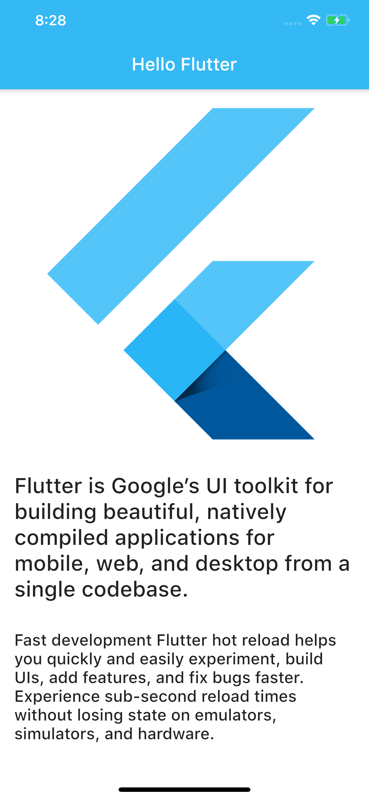

# HelloFlutter

My First Flutter App

## What I have learned by building this App

- The ```main()``` is the starting point for all our Flutter Apps.
- ```MaterialApp()``` confrims Material Design Style Created by Google 
```
home:
The widget for the default route of the app
```
- ```Scaffold()``` It will expand or occupy in the whole device screen. It will occupy the available space. Scaffold will provide a framework to implement the basic material design layout of the application. Also added custom title and background Color.
 ```
 body: 
 The primary content of the scaffold.
 ```
  ### Widgets
  
- ```Center``` A widget that centers its child within itself.
- ```Padding``` A widget that insets its child by the given padding.
- ```Column``` A widget that displays its children in a vertical array.
- ```Image``` A widget that displays an image and learned adding a image to the app from assets and also how to use a ```NetworkImage```.

## Display Mode 



## Like to Connect

#### [Instagram](https://www.instagram.com/irangareddy/)
#### [Twitter](https://twitter.com/irangareddy)
#### [LinkedIn](https://www.linkedin.com/feed/)
