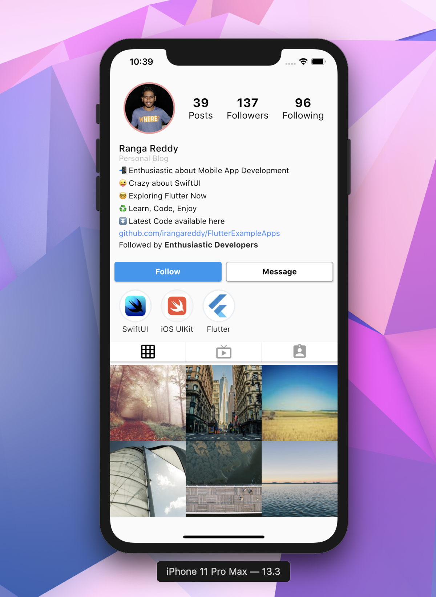

# MyProfile

Instagram Profile built using Rows and Columns

## What I learned Building this App

- ```Expand``` : A widget that expands a child of a Row, Column, or Flex so that the child fills the available space.
- ```Raised Button``` A raised button is based on a Material widget whose Material.elevation increases when the button is pressed.

## Display Mode 
<p align="center">

</p>

## Like to Connect

[Instagram](https://www.instagram.com/irangareddy/) | [Twitter](https://twitter.com/irangareddy) | [LinkedIn](https://www.linkedin.com/feed/) |
------------ | ------------- | ---------------|