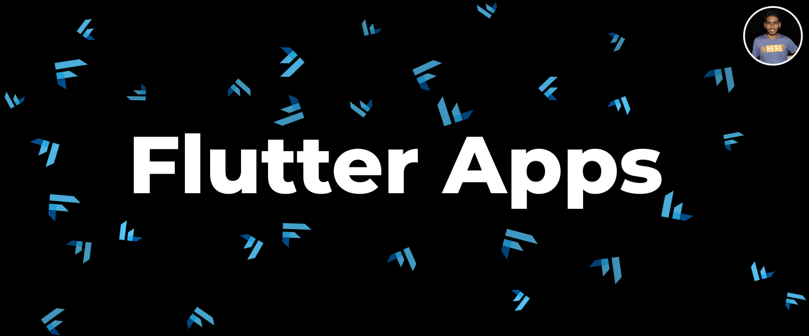

# Flutter Apps

Open Source Flutter Apps

## Apps

- **[Hello Flutter](https://github.com/irangareddy/FlutterExampleApps/tree/master/HelloFlutter)**
- **[SpaceX](https://github.com/irangareddy/FlutterExampleApps/tree/master/SpaceX)**
- **[Instagram Profile](https://github.com/irangareddy/FlutterExampleApps/tree/master/MyProfile)**
- **[Business Card](https://github.com/irangareddy/FlutterExampleApps/tree/master/BusinessCard)**
- **[Dicee](https://github.com/irangareddy/FlutterExampleApps/tree/master/Dicee)**
- **[Xylophone](https://github.com/irangareddy/FlutterExampleApps/tree/master/Xylophone)**
- **[Quiz Game](https://github.com/irangareddy/FlutterExampleApps/tree/master/Quiz)**
- **[WWDC20](https://github.com/irangareddy/FlutterExampleApps/tree/master/WWDC20)**
- **[Destini](https://github.com/irangareddy/FlutterExampleApps/tree/master/Destini)**
- **[BMI Calculator](https://github.com/irangareddy/FlutterExampleApps/tree/master/BMI_Calculator>)**

## App Previews

## App Gallery

## Like to Connect

[Instagram](https://www.instagram.com/irangareddy/) | [Twitter](https://twitter.com/irangareddy) | [LinkedIn](https://www.linkedin.com/in/irangrareddy) |
------------ | ------------- | ---------------|

